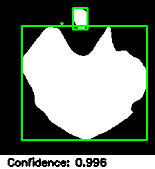

# Team Learners
## Team Members
- Akash Sen
- Tanmay Garg
- V Deepak Reddy
- Shantam Gulati

## Results Table
Accuracy: 0.9980

Recall: 0.9959

F1 Score: 0.9979

Average Precision: 0.36695597093683535

Mean-Average Precision: 0.3092386465454942

IoU: 0.8019488283046221

## Best Results for Validation Dataset

## Best Results for Testing Dataset

## References
[nnU-Net](https://www.google.com/url?q=https://www.nature.com/articles/s41592-020-01008-z&sa=D&source=docs&ust=1677235958581755&usg=AOvVaw3dWL0SrITLhCJUBiNIHCQO)

    Isensee, F., Jaeger, P. F., Kohl, S. A., Petersen, J., & Maier-Hein, K. H. (2021). nnU-Net: a self-configuring 
    method for deep learning-based biomedical image segmentation. Nature methods, 18(2), 203-211.

[VGG](https://arxiv.org/abs/1409.1556)
    
    Karen Simonyan, & Andrew Zisserman. (2015). Very Deep Convolutional Networks for Large-Scale Image Recognition.

[Saliency Maps](https://arxiv.org/abs/1312.6034)
    
    Karen Simonyan, Andrea Vedaldi, & Andrew Zisserman. (2013). Deep Inside Convolutional Networks: Visualising Image Classification Models and Saliency Maps.

